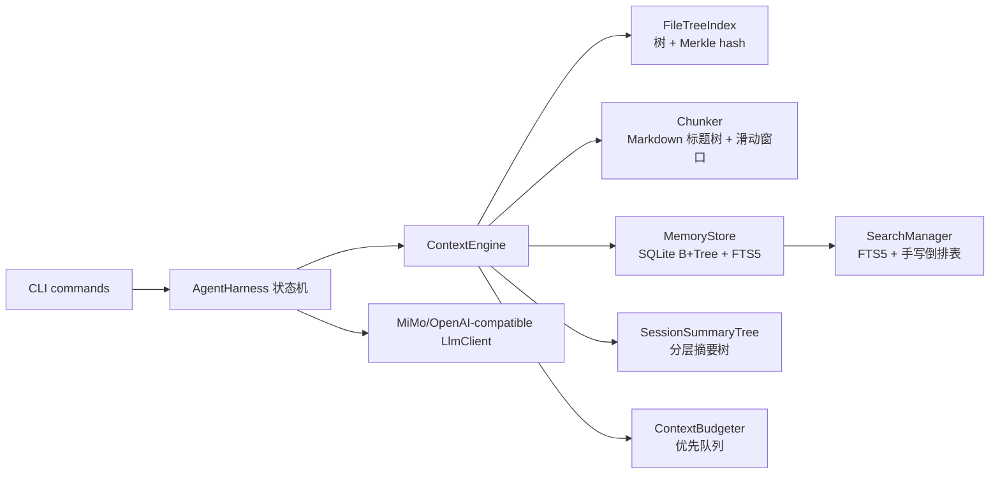
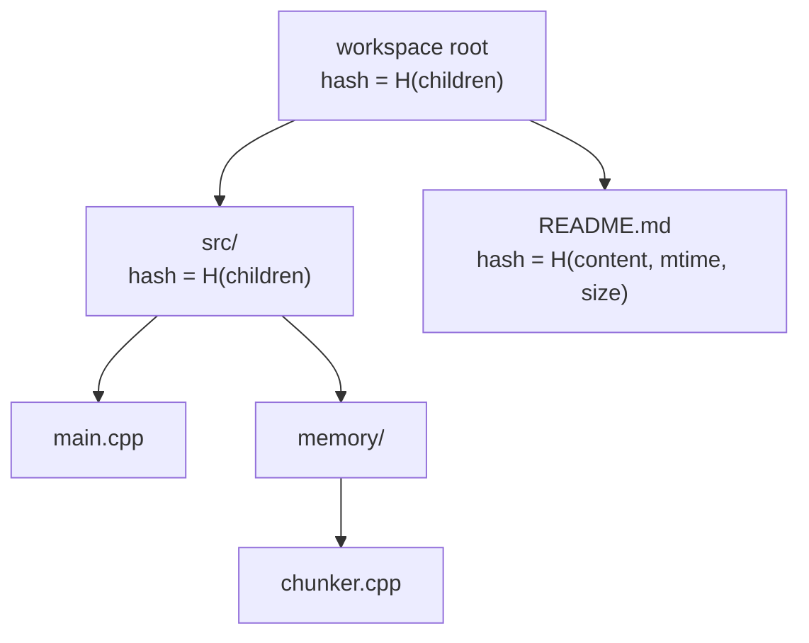
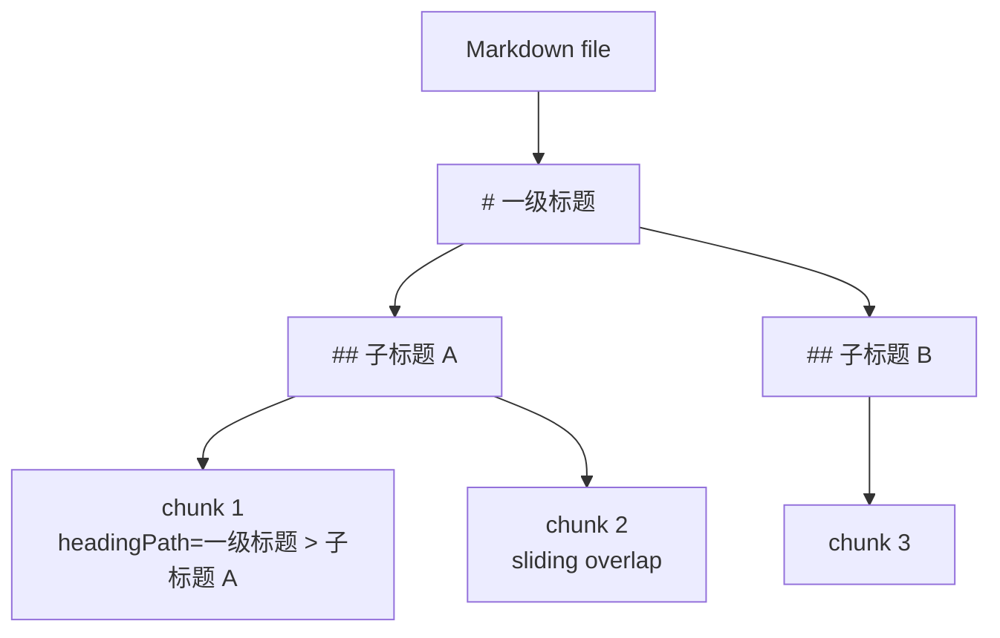
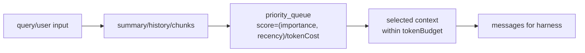
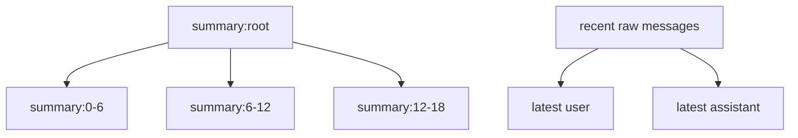
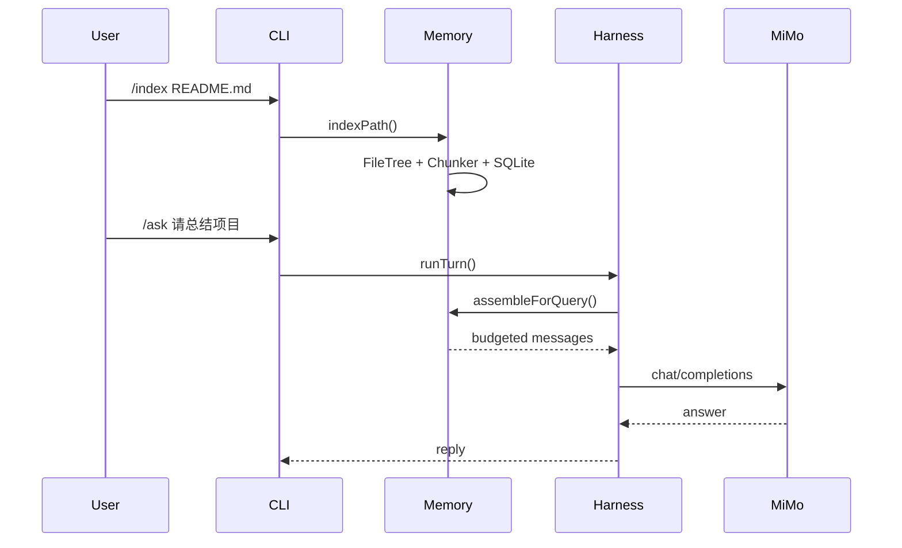

# ClawLite 设计报告

## 目标

ClawLite 的最终版聚焦长上下文管理：大文件进入系统后，先被组织成树和 chunk，再通过预算器选出最值得给模型看的内容。项目重点不是“做一个复杂 agent 平台”，而是展示基础数据结构如何支撑工程能力。

## 总体架构

## 文件树与增量索引

每次 `/index <path>` 会构建文件树。文件节点保存内容 hash，目录节点保存子节点 hash 的组合。第二次索引时，只要比较旧 hash 和新 hash，就能知道哪些文件真的变了。

## 结构化分块

普通滑动窗口容易把语义切碎；ClawLite 先保留标题路径，再在过长 section 内滑动切块。这样上下文被注入时，模型能知道 chunk 属于哪个章节。

## 上下文预算

预算器把摘要节点、最近消息、文件 chunk 都当作候选项。每个候选项有 token 成本、重要度和时间近度。优先队列负责选出性价比最高的内容。

## 会话摘要树

旧对话被压成 summary node，最近几轮保留原文。这样长会话不会无限增长，也不会完全丢掉历史脉络。

## 复杂度简表

| 功能 | 主要结构 | 复杂度 |
| --- | --- | --- |
| 文件树构建 | 树 + hash | O(N) |
| 变化检测 | hash map | O(N) 对比，单文件变化只重建相关路径 |
| Markdown 分块 | 标题树 + 滑动窗口 | O(L) |
| FTS 查询 | 倒排索引 | 近似 O(term postings) |
| 手写倒排表 | unordered_map + posting list | O(total terms) 构建 |
| 上下文选择 | priority_queue | O(N log N) |
| LRU 缓存 | list + unordered_map | O(1) get/put |

## 端到端流程

